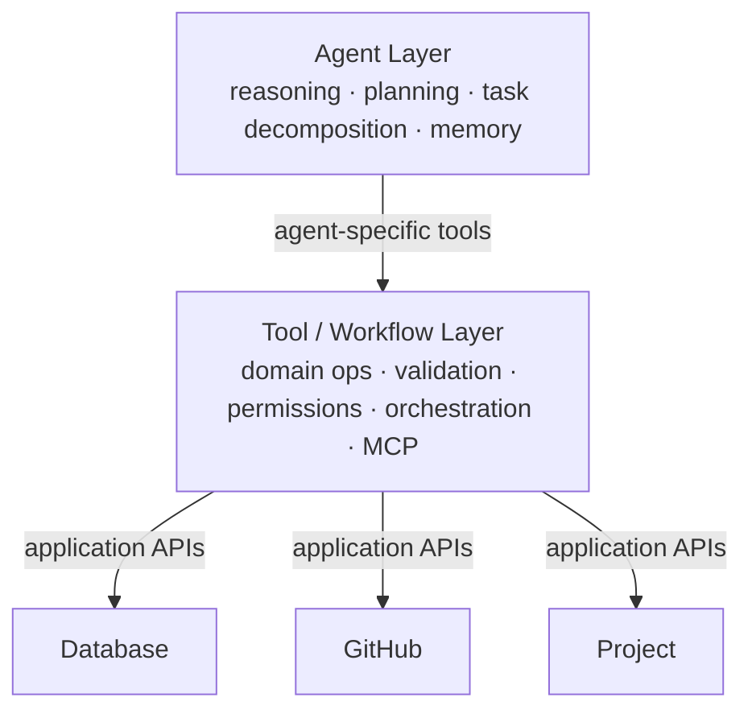

# Project Overview — `test_framework`

## What it is

A **C++23 desktop application and experimentation sandbox** that combines an
OpenGL/ImGui graphical front end with a small **AI agent runtime** and a
DocTest-based unit test suite. It builds to a single CMake executable (`test`)
that runs in one of two modes, selected by the `testing` flag in
`src/main.cpp`:

- **Application mode** — a GLFW window with a GLAD-loaded OpenGL context and a
  Dear ImGui UI (`app` → `window`), driven by an input manager.
- **Testing mode** — the DocTest suite (math utilities, tool layer, AI agent
  subsystem).

## Project goal

Provide a workbench to **configure AI agent setups for any project** — author
agents, give them plans, coordinate them (including agent-to-agent
delegation), and export that configuration so an external project can run those
agents with an open coding agent.

## MVP definition

The MVP is reached when a user can, through the app:

1. **Create and configure agents** (name, endpoint, enabled state, permissions).
2. **Author plans** for a goal (planner produces ordered steps; preview + run).
3. **Coordinate agents**, including A2A delegation between peers.
4. **Export** the agent setup (agents, configs, plans, tool bindings,
   permissions) to a **portable artifact**.
5. A target project can **consume that artifact** and run the agents with an
   open coding agent ("open code").

Progress toward MVP is tracked in [`../status/tracker.md`](../status/tracker.md)
and sequenced in [`../plans/mvp-roadmap.md`](../plans/mvp-roadmap.md).

## Architecture (three conceptual layers)

| Layer | Responsibility | Location | Detail |
|-------|----------------|----------|--------|
| **Agent** | Reasoning, planning, task decomposition, memory | `src/data/` | [layer-agent.md](layer-agent.md) |
| **Tool / Workflow** | Domain ops, validation, permissions, MCP orchestration | `src/data/tools/` | [layer-tools.md](layer-tools.md) |
| **Backends** | Application APIs (database, GitHub, project) | `src/data/backends/` | [layer-backends.md](layer-backends.md) |
| **App / Infra** | Service layer, persistence, UI, build/test | `src/features`, `src/repository`, `src/ui` | [app-and-infra.md](app-and-infra.md) |

## Build / test / run summary

- **Language:** C++23 (C11 for GLAD). `CMAKE_CXX_EXTENSIONS OFF`.
- **Build:** CMake (>= 3.20), **Ninja** generator, **MSVC** toolchain.
  MSVC requires `/Zc:preprocessor` (Glaze) and `/EHsc` (DocTest).
- **Test:** DocTest; testing mode toggled by `testing` flag in `src/main.cpp`.
- **Optional Postgres:** `TF_ENABLE_POSTGRES` + vendored `libpqxx`; falls back
  to an in-memory repository when `libpq` is absent.
- **Sources:** collected via `file(GLOB_RECURSE src/*.cpp)`;
  `postgres_repository.cpp` excluded unless the backend is enabled.

See the project [`README.md`](../../README.md) for full build steps and the
startup **profiling** findings (`glfwCreateWindow` dominates init ~80%).

### Vendored dependencies (`external/`)
GLFW (windowing/input) · GLAD (GL loader) · Dear ImGui (GUI) · Glaze
(header-only JSON/serialization) · DocTest (tests) · profiler (single-header
scoped profiler) · libpqxx (optional PostgreSQL client).

## Glossary

- **`src/data/` (project AI / "data"):** the project's own agent/planner/memory
  **data structures** it manipulates. Candidate rename: `src/data/` (see
  [decisions](../notes/decisions.md)).
- **`docs/` (coordination workspace):** this documentation/coordination
  folder used by AI agents working *on* the project.
- **A2A:** agent-to-agent delegation (`agent_call_tool`).
- **MCP:** Model Context Protocol transport for external tools (`mcp_client`).
- **Repository:** durable source of truth for agents (in-memory or PostgreSQL).
- **agent_service:** the only app-facing façade; the UI talks solely to it.
- **Open code / open coding agent:** an external coding agent that consumes the
  exported agent setup to actually run tasks in a target project.
